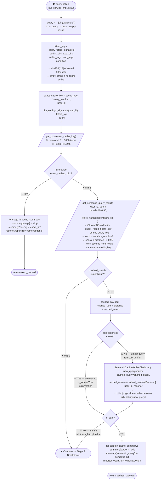
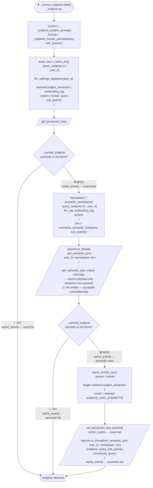
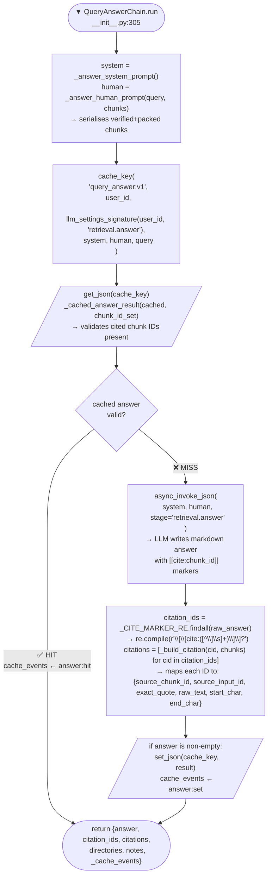
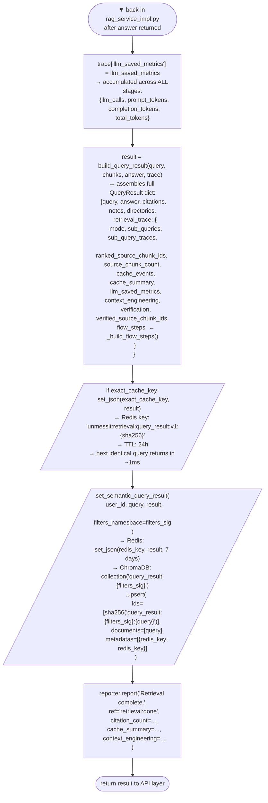

# UnmessIt.AI — Query Pipeline: Complete Step-by-Step Reference

> Every minute step of what happens between the user pressing **Ask** and receiving an answer.

---

## Overview

The query pipeline is a multi-stage RAG (Retrieval-Augmented Generation) system. Every stage has its own **exact cache** (hash-keyed Redis lookup, ~1 ms) and sometimes a **semantic cache** (embedding-based ChromaDB lookup, ~200 ms). The system is designed so that warm caches skip LLM calls entirely, and near-exact matches skip the LLM verifier.

```
User Query
    │
    ▼
[Stage 0] Top-Level Exact Cache          → Redis hash lookup (~1ms)
    │ MISS
    ▼
[Stage 1] Top-Level Semantic Cache       → ChromaDB + Redis (~200ms)
    │ MISS
    ▼
[Stage 2] Query Breakdown                → LLM → sub-queries
    │
    ▼
[Stage 3] Subject Extraction             → LLM → named entities
    │
    ▼
[Stage 4] Evidence Search (batch exact)  → Redis hash
    │ MISS
    ▼
[Stage 5] Per-Sub-Query Search           → Vector + Lexical + Recall + Semantic Cache
    │
    ▼
[Stage 6] Context Compaction             → LLM (optional, large contexts only)
    │
    ▼
[Stage 7] Verification                   → LLM → on-topic / off-topic classification
    │
    ▼
[Stage 8] Answer Generation              → LLM → final answer with citations
    │
    ▼
Response saved to both exact + semantic top-level cache
```

---

## Caching Infrastructure

| Layer | Backend | Speed | Key type |
|---|---|---|---|
| **Exact** | In-memory LRU (1 000 items) → Redis (24h TTL) | ~1 ms | SHA-256 of (namespace, user_id, llm_settings, filters, query, …) |
| **Semantic** | ChromaDB (embeddings) + Redis (7-day payload) | ~200 ms | Normalised query text embedded and vector-searched |

**Every cache key includes `llm_settings_signature`** — a JSON hash of provider, model, base_url, temperature, and max_tokens. Changing any LLM setting auto-invalidates all caches for that user.

**The filter signature** (`_query_filters_signature`) is a 16-char hex hash of `within_directories`, `excluding_directories`, `within_tags`, `excluding_tags`, and `within_tags_condition`. Empty string when no filters are active.

---

## Stage 0 — Top-Level Exact Cache

**File:** `rag_service_impl.py`
**Cost if hit:** ~1 ms Redis GET. Zero embedding calls, zero LLM calls.

### Steps:
1. Normalise whitespace in the query string (`" ".join(data.split())`).
2. Compute `filters_sig` — a stable 16-char hash of all active directory and tag filters. Returns `""` when no filters are set.
3. Compute `exact_cache_key`:
   ```
   SHA-256(["query_result:v1", user_id, llm_settings_signature, filters_sig, query])
   ```
4. Call `retrieval_cache.get_json(exact_cache_key)` — checks in-memory LRU first, then Redis.
5. **HIT:** Mutate `cache_summary` (set all stages to `"skip"`, add `"query": "exact_hit"`), return immediately.
6. **MISS:** Fall through to Stage 1.

---

## Stage 1 — Top-Level Semantic Cache

**File:** `rag_service_impl.py`
**Cost if hit:** ~200 ms embedding call + ChromaDB vector search + Redis GET. No LLM call if distance < 0.02.

### Steps:
1. Call `retrieval_cache.get_semantic_query_result(user_id, query, threshold=0.95, filters_namespace=filters_sig)`.
2. Internally:
   - Selects ChromaDB collection scoped to `query_result:{filters_sig}` (or `query_result` if no filters).
   - Embeds the query text via ChromaDB's embedding function.
   - Vector-searches for the top-1 nearest stored query.
   - Checks `1 - distance >= 0.95` threshold. Below → cache miss.
   - Fetches the full payload from Redis using the `redis_key` stored in Chroma metadata.
3. **HIT — near-exact (distance < 0.02):** Same text. Skip the LLM verifier. `is_safe = True`.
4. **HIT — similar (0.02 ≤ distance < 0.05):** Run `SemanticCacheVerifierChain` — LLM judge that receives the new query, the original cached query, and the cached answer, returning `true/false`.
5. **Safe:** Mutate `cache_summary` (set all stages to `"skip"`, add `"semantic_query": "semantic_hit"`), return cached payload.
6. **Unsafe / MISS:** Fall through to Stage 2.

---

## Stage 2 — Query Breakdown

**File:** `_breakdown.py`
**Purpose:** Decompose one query into ≤ 6 focused, embedding-friendly sub-queries to maximise recall coverage.

### Step 2a — Exact Cache
1. Build system and human prompts.
2. Key: `SHA-256(["query_breakdown:v1", llm_sig, system_prompt, human_prompt, query])`.
3. `get_json(cache_key)` → **HIT:** return cached sub-queries. Emit `{stage: "breakdown", status: "hit"}`.
4. **MISS:** emit miss.

### Step 2b — Semantic Cache
1. Namespace: `SHA-256[:24](["breakdown:v1", user_id, llm_sig, system_prompt])`.
2. Text: `normalize_semantic_text(query)` — lowercase, strip punctuation, collapse whitespace.
3. `get_semantic_json_match(user_id, namespace, text, threshold=0.95)` → ChromaDB vector search.
4. **HIT — distance < 0.02:** Same phrasing, skip verifier, return cached sub-queries. Emit `{stage: "breakdown", cache: "semantic", status: "hit"}`.
5. **HIT — distance ≥ 0.02:** Run `SemanticSubQueryVerifierChain` — compare new query vs cached query to confirm same intent and scope. Guards against temporal constraints, different subjects with similar distances.
6. **Verified safe:** Return cached sub-queries. Emit semantic hit.
7. **Unsafe / MISS:** Emit `{stage: "breakdown", cache: "semantic", status: "miss"}`.

### Step 2c — LLM Call
1. Call `json_client.async_invoke_json(system, human, stage="retrieval.query_breakdown")`.
2. Extract `sub_queries` list from JSON response.
3. Run `_deterministic_expansions(query)`:
   - **Attribute terms** (appearance, count, traits…) → add `"{subject} appearance physical details"` searches.
   - **Comparison terms** (compare, vs, similar…) → add per-subject and cross-subject contrast searches.
   - **Reasoning terms** (cause, why, timeline…) → add `"{subject} evidence context causes effects"` searches.
   - **Multi-part queries** (≥80 chars, ≥3 comma/and-separated clauses) → split into individual clause searches.
4. Merge: `[original_query, ...deterministic, ...llm_sub_queries]`, deduped, capped at 6.
5. Save to exact cache: `set_json(cache_key, {sub_queries, query})`. Emit `"set"`.
6. Save to semantic cache: `set_semantic_json(user_id, namespace, text, payload)`. Emit `"set"`.
7. Return sub-queries.

---

## Stage 3 — Subject Extraction

**File:** `_subjects.py`
**Purpose:** Resolve implicit entity descriptions into precise proper names for full-text recall-key search.

### Step 3a — Exact Cache
1. Key: `SHA-256(["query_subjects:v1", user_id, llm_sig, system_prompt, human_prompt, query, sub_queries])`.
2. **HIT:** emit `{stage: "subjects", cache: "exact", status: "hit"}`, return.

### Step 3b — Semantic Cache
1. Namespace: `SHA-256[:24](["query_subjects:v1", user_id, llm_sig, embedding_sig, system_prompt])`.
2. Text: `normalize_semantic_text(query, sub_queries)`.
3. **HIT:** emit `{stage: "subjects", cache: "semantic", status: "hit"}`, return.

> ⚠️ Semantic hit is accepted unconditionally (no verifier). Tracked as a known gap.

### Step 3c — LLM Call
1. LLM resolves entity descriptions to exact proper names.
2. Save to both exact and semantic caches. Emit `"set"` for both.

---

## Stage 4 — Evidence Search Batch Exact Cache

**File:** `_search.py` (`search_node`)
**Purpose:** Check if the entire evidence gathering step was already run with this exact state.

### Steps:
1. Key: `SHA-256(["evidence_search", version, user_id, query, sub_queries, subjects, index_version, embedding_sig, filters_sig])`.
2. **HIT:** Return complete pre-gathered chunk set. Skip all sub-query searches. Emit `{stage: "evidence", status: "hit"}`.
3. **MISS:** Emit miss, proceed to Stage 5.

> Most impactful cache in the middle of the pipeline — a hit skips every sub-query search, every vector call, every lexical search, and every recall expansion.

---

## Stage 5 — Per-Sub-Query Evidence Search

**File:** `_search.py` (`_evidence_for`)
**Purpose:** For each of the ≤6 sub-queries, gather candidate source chunks via three parallel strategies.

All sub-query searches run **concurrently** via `asyncio.gather`.

### Step 5a — Semantic Evidence Cache (per sub-query)
1. Namespace: `SHA-256[:24](["evidence-semantic-candidates-v2", user_id, index_version, embedding_sig, filters_sig])`.
2. Text: `normalize_semantic_text(sub_query, extracted_subjects)`.
3. Validate payload: checks `cache_version`, `index_version`, `embedding_signature`, `filters` — stale entries are rejected.
4. **HIT — distance < 0.02:** Skip `SemanticSubQueryVerifierChain`. Return cached packed chunks immediately.
5. **HIT — distance ≥ 0.02:** Run `SemanticSubQueryVerifierChain` — LLM compares old vs new sub-query. Guards against constraint drift, subject confusion, temporal shifts.
6. **Verified safe:** Return cached packed chunks. Emit `{stage: "evidence_semantic", status: "hit"}`.
7. **Unsafe / MISS:** Continue to live search strategies.

### Step 5b — Vector Search (Dense Retrieval)
1. Embed sub-query using configured embedding model.
2. Query ChromaDB `source_chunks` collection for `top_k` nearest neighbours.
3. Apply all directory/tag filters.

### Step 5c — Lexical Search (Sparse)
1. Tokenise sub-query into keywords.
2. Full-text search on SQLite/Postgres source chunk index.
3. Same filter application as vector search.

### Step 5d — Recall Key Expansion
1. Use extracted subjects from Stage 3 as recall keys.
2. Fetch pre-computed `recall_links` — chunks tagged or linked to the subject during ingestion.
3. Surfaces chunks that wouldn't score highly in vector/lexical search but are semantically anchored to a named entity.

### Step 5e — Merge + Score
1. Union all chunk IDs from vector, lexical, and recall search.
2. Score: count how many sub-queries each chunk appeared in. More = higher rank.
3. Emit `query_terms:{n}` score reasons per chunk.

### Step 5f — Save Semantic Evidence Cache
1. Pack top chunks into compact payload (IDs + text + summary snippets).
2. `set_semantic_json(user_id, namespace, text, payload)`. Emit `"set"`.

### Step 5g — Save Batch Exact Evidence Cache
1. After all sub-queries merged: `set_json(evidence_cache_key, {...})`. Emit `{stage: "evidence", status: "set"}`.

---

## Stage 6 — Context Compaction (Optional)

**File:** `_search.py` (`_pack_context`)
**Purpose:** When raw context exceeds ~9 000 chars, use an LLM to select the most relevant sentence-level snippets per chunk, reducing context size by up to 72%.

### Steps:
1. Check `_should_llm_compact(raw_chars, packed_chars)` — only triggers above thresholds.
2. Key: `SHA-256(["context-engineering-llm:v1", user_id, llm_sig, query, per_chunk_text_hash_and_summary_hash])`.
3. **HIT:** Return pre-compacted snippets immediately.
4. **MISS:** LLM selects most relevant sentences within each chunk.
5. On failure: fall back to deterministic snippet selection (first N chars per chunk).
6. Save to exact cache only when LLM returns valid output. Emit `"set"`.
7. Record: `raw_chars`, `packed_chars`, `saved_chars`, `shrink_percent`.

---

## Stage 7 — Verification

**File:** `__init__.py` (`QueryVerifierChain`)
**Purpose:** LLM judge classifies each chunk as on-topic or off-topic. Can trigger a retry retrieval pass if evidence is insufficient.

### Step 7a — Exact Cache
1. Key: `SHA-256(["query_verifier:v1", user_id, attempt, llm_sig_verifier, system_prompt, human_prompt, query])`.
2. Human prompt includes full serialised chunk payloads — any change in chunks = new key.
3. **HIT:** Return cached `{status, on_topic_ids, off_topic_ids, reason, retry_query}` immediately.

### Step 7b — LLM Call
1. Returns: `status` (`"sufficient"` or `"needs_retry"`), `on_topic_ids`, `off_topic_ids`, `reason`, `retry_query`.
2. Save to exact cache. Emit `{stage: "verifier", status: "set"}`.

### Step 7c — Retry Pass (if `needs_retry`)
1. If `status == "needs_retry"` and `retry_query` differs from original:
   - Run second evidence search using `retry_query`.
   - Combine with original chunks.
   - Run verifier again (attempt 2, separate cache key).
2. Final verified chunks = `on_topic_ids` of the last verification.

---

## Stage 8 — Answer Generation

**File:** `__init__.py` (`QueryAnswerChain`)
**Purpose:** LLM synthesises the final answer from verified chunks with inline `[[cite:chunk_id]]` markers.

### Step 8a — Exact Cache
1. Key: `SHA-256(["query_answer:v1", user_id, llm_sig_answer, system_prompt, human_prompt, query])`.
2. Human prompt includes full verified chunk payloads.
3. **HIT:** Return cached answer immediately.

### Step 8b — LLM Call
1. LLM produces markdown answer with `[[cite:chunk_id]]` inline markers.
2. Save to exact cache only when answer is non-empty. Emit `{stage: "answer", status: "set"}`.

### Step 8c — Citation Resolution
1. Parse `[[cite:chunk_id]]` markers.
2. Map each to `source_input_id`, `exact_quote`, `raw_text`, `start_char`, `end_char`.
3. Return `{answer, citation_ids, citations}`.

---

## Final Step — Save Top-Level Caches + Build Response

1. `build_query_result()` assembles the full `QueryResult` including `retrieval_trace` with all sub-query traces, cache events, verification, LLM saved metrics, context engineering stats, and `flow_steps` UI timeline.
2. Save to **top-level exact cache**: `set_json(exact_cache_key, result)` — next identical query returns in ~1 ms.
3. Save to **top-level semantic cache**: `set_semantic_query_result(user_id, query, result, filters_namespace=filters_sig)`.
4. Return `QueryResult` to the API layer.

---

## Cache Event Reference

| Stage | Cache | Status | Meaning |
|---|---|---|---|
| `query` | — | `exact_hit` | Top-level exact cache returned result |
| `semantic_query` | — | `semantic_hit` | Top-level semantic cache returned result |
| `breakdown` | — | `hit` / `miss` / `set` | Exact breakdown cache |
| `breakdown` | `semantic` | `hit` / `miss` / `set` | Semantic breakdown cache |
| `subjects` | `exact` | `hit` / `miss` / `set` | Exact subject extraction cache |
| `subjects` | `semantic` | `hit` / `miss` / `set` | Semantic subject extraction cache |
| `evidence` | — | `hit` / `miss` / `set` | Batch evidence exact cache |
| `evidence_semantic` | — | `hit` / `miss` / `set` | Per-sub-query semantic evidence cache |
| `verifier` | — | `hit` / `miss` / `set` | Verifier exact cache |
| `answer` | — | `hit` / `miss` / `set` | Answer exact cache |

---

## Data Flow Diagram

```
User Query + Filters
        │
        ├─[Stage 0]─ Exact Cache ─────────────────────────────────────────────── RETURN
        │                 │ MISS
        ├─[Stage 1]─ Semantic Cache ─ verifier (if dist ≥ 0.02) ──────────────── RETURN
        │                 │ MISS
        ├─[Stage 2]─ Breakdown ─── exact → semantic (+ verifier) → LLM
        │                 │              └─ sub_queries[]
        ├─[Stage 3]─ Subjects ──── exact → semantic → LLM
        │                 │              └─ subjects[]
        ├─[Stage 4]─ Evidence Batch Exact ───────────────────────────────────── RETURN
        │                 │ MISS
        │             [Stage 5] ← runs concurrently per sub-query
        │               ├─ semantic cache ─ verifier (dist ≥ 0.02) ─ cached chunks
        │               ├─ vector search ─────────────────────────── chunk IDs
        │               ├─ lexical search ────────────────────────── chunk IDs
        │               └─ recall key expansion ──────────────────── chunk IDs
        │                         └─ merge + score
        ├─[Stage 6]─ Context Compaction (optional) ─ exact → LLM
        │
        ├─[Stage 7]─ Verifier ─ exact → LLM → [retry?] → on_topic_ids
        │
        ├─[Stage 8]─ Answer ─── exact → LLM → answer + citations
        │
        └─── save top-level exact + semantic ────────────────────────────── RETURN
```

---

## Complete Code-Accurate Flowchart

> Every decision node maps to an exact condition in the source code. Function names and variable names match the actual implementation.

### Legend
- 🟦 Rectangle — process / computation
- 🔷 Diamond — decision / branch
- 🟩 Stadium — entry / exit point
- 🟨 Parallelogram — cache read or write I/O
- Subgraphs group stages

---

### Stage 0 & 1 — Top-Level Cache Checks



---

### Stage 2 — Query Breakdown

```mermaid
flowchart TD
    BD_START([▼ _decompose called\n_breakdown.py:72]) --> BD_PROMPTS
    BD_PROMPTS["system = _breakdown_system_prompt()\nhuman = _breakdown_human_prompt(query)\n  → 'QUERY:\\n{query}\\n\\nReturn JSON: ...'"] --> BD_EXACTKEY

    BD_EXACTKEY["cache_key(\n  'query_breakdown:v1',\n  llm_settings_signature(user_id,\n    'retrieval.query_breakdown'),\n  system, human, query\n)"] --> BD_EXACTGET

    BD_EXACTGET[/"get_json(cache_key)\nmemory LRU → Redis"/] --> BD_EXACT_HIT_Q

    BD_EXACT_HIT_Q{"_cached_sub_queries\n(cached) is not None?"} -->|"✅ HIT"| BD_EXACT_HIT
    BD_EXACT_HIT_Q -->|"❌ MISS\ncache_events ← {stage:breakdown, status:miss}"| BD_SEM_SETUP

    BD_EXACT_HIT["cache_events ← {stage:breakdown, status:hit}\nreturn sub_queries"] --> BD_DONE
    BD_DONE([sub_queries returned])

    BD_SEM_SETUP["semantic_key = _breakdown_semantic_cache_key(query, user_id, system)\n  namespace = semantic_namespace(\n    'breakdown:v1', user_id,\n    llm_sig, system_prompt\n  ) → sha256[:24]\n  text = normalize_semantic_text(query)\n    → lowercase, strip punct, collapse ws"] --> BD_SEM_GET

    BD_SEM_GET[/"asyncio.to_thread(\n  get_semantic_json_match,\n  user_id, namespace, text\n)\n→ ChromaDB collection(user_id, namespace)\n→ .query(query_texts=[text], n_results=1)\n→ checks 1-distance >= SEMANTIC_THRESHOLD\n→ returns (payload_dict, distance) or None"/] --> BD_SEM_MATCH_Q

    BD_SEM_MATCH_Q{"match is not None?"} -->|"❌ MISS\ncache_events ← semantic:miss"| BD_LLM
    BD_SEM_MATCH_Q -->|"✅ HIT"| BD_SEM_UNPACK

    BD_SEM_UNPACK["payload, distance = match\ncached_sub_queries = _cached_sub_queries(payload)\ncached_query = payload.get('query', '')"] --> BD_SEM_VALID_Q

    BD_SEM_VALID_Q{"cached_sub_queries\nand cached_query?"} -->|"❌ invalid payload"| BD_LLM
    BD_SEM_VALID_Q -->|"✅ valid"| BD_SEM_DIST_Q

    BD_SEM_DIST_Q{"abs(distance)\n< 0.02?"} -->|"✅ near-exact\nis_safe = True"| BD_SEM_SAFE_Q
    BD_SEM_DIST_Q -->|"⚠️ similar\nrun verifier"| BD_SEM_VERIFY

    BD_SEM_VERIFY["SemanticSubQueryVerifierChain(json_client).run(\n  query,           ← new query\n  cached_query,    ← old query from payload\n  user_id\n)\n→ LLM: same intent and scope?"] --> BD_SEM_SAFE_Q

    BD_SEM_SAFE_Q{"is_safe?"} -->|"❌ No\nfall through to LLM"| BD_LLM
    BD_SEM_SAFE_Q -->|"✅ Yes"| BD_SEM_HIT

    BD_SEM_HIT["cache_events ← {stage:breakdown, cache:semantic, status:hit}\nreturn cached_sub_queries"] --> BD_DONE

    BD_LLM["async_invoke_json(\n  system, human,\n  user_id=user_id,\n  stage='retrieval.query_breakdown'\n)"] --> BD_LLM_PARSE

    BD_LLM_PARSE["sub_queries = data.get('sub_queries')\nif not list or empty → return [query]\ncleaned = [str(q).strip() for q in sub_queries]"] --> BD_DETERM

    BD_DETERM["_deterministic_expansions(query)\n→ detect ATTRIBUTE_TERMS (appearance,count,traits)\n   → add '{subject} appearance physical details'\n→ detect COMPARISON_TERMS (vs,compare,similar)\n   → add per-subject contrast searches\n→ detect REASONING_TERMS (cause,why,timeline)\n   → add '{subject} evidence context causes'\n→ len>=80 and >=3 clauses\n   → _multipart_expansions → split on and/or/,"] --> BD_MERGE

    BD_MERGE["result = dedup([query, *deterministic, *cleaned])\nresult = result[:6]   ← _MAX_SUB_QUERIES\npayload = {sub_queries: result, query: query}"] --> BD_SAVE_EXACT

    BD_SAVE_EXACT[/"set_json(cache_key, payload)\ncache_events ← {stage:breakdown, status:set}"/] --> BD_SAVE_SEM

    BD_SAVE_SEM[/"asyncio.to_thread(\n  set_semantic_json,\n  user_id, namespace, text, payload\n)\n→ ChromaDB .upsert(\n    ids=[sha256(ns:text)],\n    documents=[text],\n    metadatas=[{payload: json.dumps(payload)}]\n  )\ncache_events ← {stage:breakdown, cache:semantic, status:set}"/] --> BD_DONE
```



---

### Stage 3 — Subject Extraction



---

### Stage 4 — Evidence Search Batch Exact + Stage 5 — Per-Sub-Query Search

```mermaid
flowchart TD
    EV_START([▼ search_node called\n_search.py]) --> EV_BATCHKEY

    EV_BATCHKEY["_evidence_cache_key(\n  user_id, query, sub_queries,\n  subjects, index_version,\n  embedding_sig, filters_sig\n)\n→ cache_key('evidence_search',\n    _EVIDENCE_CACHE_VERSION,\n    user_id, query, sub_queries,\n    subjects, index_version,\n    embedding_sig, filters_sig\n  )"] --> EV_BATCHGET

    EV_BATCHGET[/"get_json(cache_key)\n_valid_evidence_cache(cached, index_version)\n→ validates index_version matches"/] --> EV_BATCH_Q

    EV_BATCH_Q{"valid cached\nevidence?"} -->|"✅ HIT\ncache_events ← evidence:hit"| EV_BATCH_DONE
    EV_BATCH_Q -->|"❌ MISS\ncache_events ← evidence:miss"| EV_GATHER

    EV_BATCH_DONE([return cached chunks + trace_parts])

    EV_GATHER["asyncio.gather(\n  _evidence_for(sub_q_1, subjects, ...),\n  _evidence_for(sub_q_2, subjects, ...),\n  ...  ← up to 6 concurrent tasks\n)"] --> EV_PER

    subgraph EV_PER["Per sub-query — _evidence_for()  (runs concurrently for each)"]
        direction TD

        SEM_CAND["_semantic_evidence_candidates(sub_query, subjects, ...)\n  namespace = semantic_namespace(\n    'evidence-semantic-candidates-v2',\n    user_id, index_version,\n    embedding_sig, filters_sig\n  )\n  text = normalize_semantic_text(sub_query, subjects)"] --> SEM_CAND_GET

        SEM_CAND_GET[/"asyncio.to_thread(\n  get_semantic_json_match,\n  user_id, namespace, text, threshold=0.95\n)"/] --> SEM_CAND_Q

        SEM_CAND_Q{"match and\n_valid_semantic_evidence_payload\n(checks index_version,\nembedding_sig, filters)?"} -->|"❌ invalid/MISS\ncache_events ← evidence_semantic:miss"| LIVE_SEARCH
        SEM_CAND_Q -->|"✅ valid match"| SEM_CAND_DIST

        SEM_CAND_DIST{"abs(distance)\n< 0.02?"} -->|"✅ is_safe = True\nno verifier"| SEM_CAND_SAFE
        SEM_CAND_DIST -->|"⚠️ run verifier"| SEM_CAND_VERIFY

        SEM_CAND_VERIFY["SemanticSubQueryVerifierChain(json_client).run(\n  sub_query,      ← new\n  old_sub_query,  ← from payload\n  user_id, reporter\n)"] --> SEM_CAND_SAFE

        SEM_CAND_SAFE{"is_safe?"} -->|"✅ Yes\ncache_events ← evidence_semantic:hit"| PACKED_RETURN
        SEM_CAND_SAFE -->|"❌ No"| LIVE_SEARCH

        PACKED_RETURN(["return packed_chunks\n{semantic_cached_source_chunk_ids,\n semantic_distance, ...}"])

        LIVE_SEARCH["Run 3 searches in parallel"] --> VECTOR

        VECTOR[/"Vector Search\nchroma.source_chunk_collection(user_id).query(\n  query_texts=[sub_query],\n  n_results=top_k,\n  where={dir/tag filters}\n)"/] --> LEXICAL

        LEXICAL[/"Lexical Search\n_lexical_search(sub_query, filters)\n→ SQLite FTS full-text search"/] --> RECALL

        RECALL[/"Recall Key Expansion\n_recall_key_search(subjects)\n→ pre-linked recall_keys from\n  chunk metadata for each subject"/] --> MERGE_SCORE

        MERGE_SCORE["union chunk IDs from all 3\nscore = count(sub-queries each ID appeared in)\nranked = sorted by score desc\nemit chunk_score_reasons: query_terms:{n}"] --> CTX_COMPACT

        CTX_COMPACT["_pack_context(query, ranked_chunks, user_id, json_client)\n  _should_llm_compact(raw_chars, packed_chars)\n  → only if raw_chars > 9000"] --> CTX_Q

        CTX_Q{"LLM compaction\nneeded?"} -->|"No — small context\ndeterministic snippet select"| SAVE_SEM_EV
        CTX_Q -->|"Yes"| CTX_CACHE_KEY

        CTX_CACHE_KEY["cache_key(\n  'context-engineering-llm:v1',\n  user_id,\n  llm_sig('retrieval.context_engineering'),\n  query, chunk_sig\n)\nchunk_sig = per-chunk sha256 of text + summary"] --> CTX_CACHE_GET

        CTX_CACHE_GET[/"get_json(ctx_cache_key)"/] --> CTX_CACHE_Q

        CTX_CACHE_Q{"cached compacted\nsnippets?"} -->|"✅ HIT"| SAVE_SEM_EV
        CTX_CACHE_Q -->|"❌ MISS"| CTX_LLM

        CTX_LLM["async_invoke_json(\n  stage='retrieval.context_engineering'\n)\n→ LLM selects most relevant\n  sentences per chunk\n→ on failure: fallback to first-N chars"] --> CTX_SAVE

        CTX_SAVE[/"set_json(ctx_cache_key, compacted_payload)"/] --> SAVE_SEM_EV

        SAVE_SEM_EV[/"asyncio.to_thread(set_semantic_json,\n  user_id, namespace, text,\n  {cache_version, index_version,\n   embedding_sig, filters,\n   sub_query, packed_chunks}\n)\ncache_events ← evidence_semantic:set"/] --> PER_DONE
        PER_DONE(["return packed_chunks\nsub_trace, cache_events"])
    end

    EV_PER --> EV_MERGE_ALL
    EV_MERGE_ALL["merge + dedup all sub-query chunks\nrank by score (query_terms coverage)"] --> EV_SAVE_BATCH

    EV_SAVE_BATCH[/"set_json(evidence_cache_key,\n  {chunk_ids, packed_context, trace_parts}\n)\ncache_events ← evidence:set"/] --> EV_DONE

    EV_DONE([chunks + trace returned to rag_service_impl])
```



---

### Stage 7 — Verification (with Retry)

```mermaid
flowchart TD
    VR_START([▼ QueryVerifierChain.run\n__init__.py:99\nattempt=1]) --> VR_PROMPTS
    VR_PROMPTS["system = _verifier_system_prompt()\nhuman = _verifier_human_prompt(query, chunks)\n→ serialises ALL chunk payloads into prompt"] --> VR_KEY

    VR_KEY["cache_key(\n  'query_verifier:v1',\n  user_id, attempt,\n  llm_settings_signature(user_id, 'retrieval.verifier'),\n  system, human, query\n)\nNote: any chunk change → different key"] --> VR_GET

    VR_GET[/"get_json(cache_key)\n_cached_verifier_result(cached, valid_ids)\n→ validates on_topic_ids still in valid_ids set"/] --> VR_CACHE_Q

    VR_CACHE_Q{"cached verifier\nresult valid?"} -->|"✅ HIT\ncache_events ← verifier:hit"| VR_APPLY
    VR_CACHE_Q -->|"❌ MISS"| VR_LLM

    VR_LLM["async_invoke_json(\n  system, human,\n  stage='retrieval.verifier'\n)\n→ LLM classifies each chunk:\n  on_topic_ids, off_topic_ids,\n  status, reason, retry_query"] --> VR_SAVE

    VR_SAVE[/"set_json(cache_key, result)\ncache_events ← verifier:set"/] --> VR_APPLY

    VR_APPLY["chunks = _verified_chunks(chunks, verification)\n→ if on_topic_ids: keep only those\n→ elif off_topic_ids: remove those\n→ else: keep all"] --> VR_RETRY_Q

    VR_RETRY_Q{"status == 'needs_retry'\nAND retry_query != ''\nAND retry_query != query?"} -->|"✅ Yes — insufficient evidence"| VR_RETRY
    VR_RETRY_Q -->|"❌ No — sufficient"| VR_DONE

    VR_RETRY["Run second evidence pipeline:\n  query_evidence.run(retry_query, ...)\n  → Stages 2–5 with retry_query"] --> VR_COMBINE

    VR_COMBINE["combined_chunks = merge(chunks, retry_chunks)"] --> VR_RETRY_VERIF

    VR_RETRY_VERIF["QueryVerifierChain.run(\n  query,           ← ORIGINAL query\n  combined_chunks,\n  user_id, reporter,\n  attempt=2        ← separate cache key\n)"] --> VR_APPLY2

    VR_APPLY2["chunks = _verified_chunks(combined_chunks, retry_verification)\ntrace['verification_attempts'].append(retry_verification)"] --> VR_DONE

    VR_DONE(["verified chunks returned\ntrace['verification'] = last attempt\ntrace['verified_source_chunk_ids'] = [c['id'] for c in chunks]"])
```



---

### Stage 8 — Answer Generation



---

### Final — Assemble Result & Save Top-Level Caches


