# UnmessIt.AI: The Architecture Novel

*(A progressive, exhaustive deep dive into the engineering of an unstructured knowledge engine)*

## Prologue: The Philosophy

UnmessIt.AI is a Retrieval-Augmented Generation (RAG) application. Standard RAG (Naive RAG) chops documents into isolated paragraphs. If paragraph A has the setup and paragraph B has the punchline, Naive RAG cannot connect them. Conversely, Graph RAG forces unstructured text into rigid nodes and edges, leading to idempotency nightmares (how do you safely merge "Apple" the fruit and "Apple" the company across 10,000 documents without corrupting the graph?) and massive re-indexing costs.

UnmessIt.AI relies on **Source Chunks** as the absolute authority, enriched by **Recall Keys**. If two chunks mention "Python," they independently produce the Recall Key "Python" with contextual links. The chunks become semantically connected without the crushing overhead of a rigid graph database.

This document walks through the architecture by starting at the conceptual level and progressively layering on the real-world complexity (Caching, Durability, SSE) until we hit the exact Python implementation, culminating in the massive, fully integrated diagrams.

---

## Table of Contents
1. [Chapter 1: The Indexing Engine](#chapter-1-the-indexing-engine)
2. [Chapter 2: The Query Engine](#chapter-2-the-query-engine)
3. [Chapter 3: The Durability & Idempotency Layer](#chapter-3-the-durability--idempotency-layer)
4. [Chapter 4: The SSE (Server-Sent Events) Infrastructure](#chapter-4-the-sse-infrastructure)

---

## Chapter 1: The Indexing Engine

The indexing engine translates raw human notes into structured, retrievable vectors and entities. 

### Level 1: The Core Concept
At its most basic level, indexing is about chopping up a document and asking an LLM to explain what each piece means.

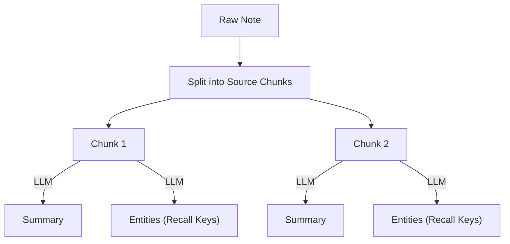

### Level 2: Idempotency, Splitting & Caching
If a user fixes a single typo in a 10,000-word document, we cannot afford to pay OpenAI to re-summarize the 9,999 words that didn't change. 
First, we split text cleanly. By default, `SourceWindowChain` splits at `2600` characters, but it intelligently seeks out double newlines (`\n\n`) to ensure paragraphs (and therefore complete ideas) are not severed in half.
We then introduce strict hashing and Exact Caching for every chunk.

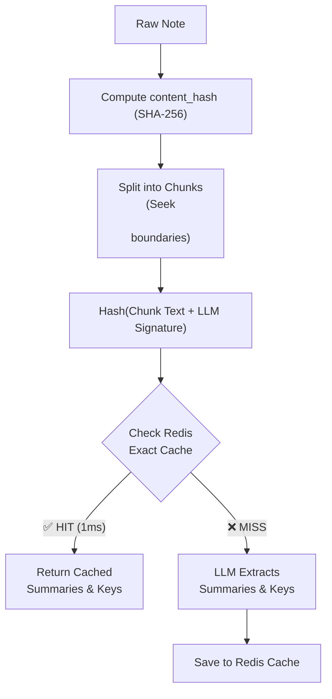

### Level 3: The 4-Layer Deduplication Guard
When the LLM hallucinates slightly different entities (e.g., "Python 3" and "Python"), we must prevent graph sprawl. The `RecallNormalizerChain` handles this strict deduplication:

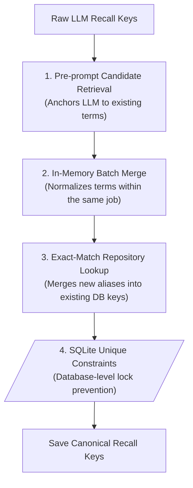
*(Code fact: The Normalizer caps aliases at 10 items, strictly enforces string length limits, and if an exact match is ambiguous, it falls back to the normalized name match to ensure safe merging).*

### Level 4: The Code Reality (Durable LangGraph)
Because indexing takes time and APIs fail, the entire sequence is wrapped in a durable LangGraph state machine. Each step acts as a deterministic checkpoint.

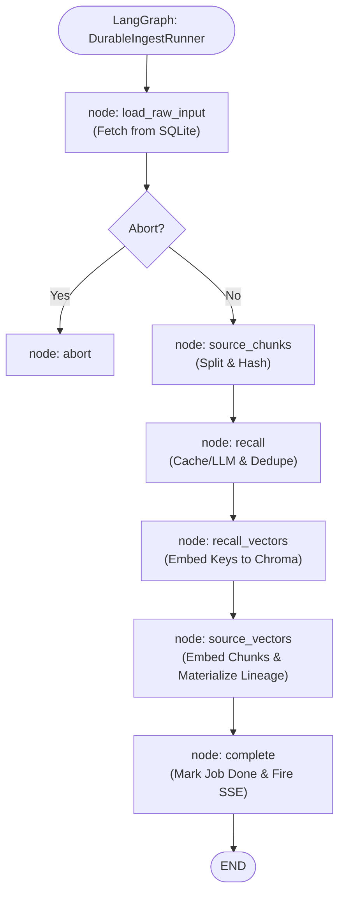

Here is the exact Python implementation from `server/src/services/rag/private/durability/runner.py` showing how this graph is constructed in memory:

```python
    def _build_graph(self):
        """Build the fixed durable ingest workflow once per runner."""
        graph = StateGraph(IngestGraphState)
        graph.add_node("load_raw_input", self._load_raw_input)
        graph.add_node("source_chunks", self._source_chunk_node)
        graph.add_node("recall", self._recall_node)
        graph.add_node("recall_vectors", self._recall_vector_node)
        graph.add_node("source_vectors", self._source_vector_node)
        graph.add_node("complete", self._complete_node)
        graph.add_node("abort", self._abort_node)
        
        graph.add_edge(START, "load_raw_input")
        graph.add_conditional_edges("load_raw_input", self._after_load_raw_input, {"abort": "abort", "continue": "source_chunks"})
        graph.add_edge("source_chunks", "recall")
        graph.add_edge("recall", "recall_vectors")
        graph.add_edge("recall_vectors", "source_vectors")
        graph.add_edge("source_vectors", "complete")
        
        graph.add_edge("complete", END)
        graph.add_edge("abort", END)
        return graph.compile()
```

### Level 5: The Full Integrated Picture
Now that we have explained every component piece-by-piece, here is the brutal reality of the absolute, end-to-end Indexing flow integrating the DB, the LangGraph, the Checkpoints, the Embedding, the Cache, and the SSE fanout.

```mermaid
flowchart TD
    START([fa:fa-play POST /notes/]) --> SAVENOTE
    SAVENOTE["Save note to SQLite\nWrite event_outbox ('note.created')"] --> SUBMIT
    SUBMIT["RAG Listener consumes event via Redis Streams\nsubmit_ingest_job(job_id=note_id)"] --> APIRET

    APIRET([Return 200 OK to User])

    SUBMIT -.-> BGWORK
    BGWORK(["Background Ingest Job Starts (LangGraph workflow)"]) --> RAWINPUT

    RAWINPUT["Hash text → content_hash\nSave/reuse raw_input row"] --> CHK_RAW
    CHK_RAW[/"Checkpoint: raw_input"/] --> SPLIT

    SPLIT["Split raw_input into source windows\nSave as source_chunks\nCompute deterministic piece hash"] --> CHK_PIECE
    CHK_PIECE[/"Checkpoint: source_piece"/] --> CHUNK_LOOP

    CHUNK_LOOP([▼ Loop over each source_chunk]) --> CACHE_SUMM

    CACHE_SUMM[/"Exact Cache: SourceChunkDraftChain\nKey: SHA256(text) + llm_sig"/] --> SUMM_Q

    SUMM_Q{"Summary\nCached?"} -->|"✅ HIT"| CACHE_REC
    SUMM_Q -->|"❌ MISS"| LLM_SUMM

    LLM_SUMM["LLM: Generate neutral summary\nSave to Exact Cache"] --> CACHE_REC

    CACHE_REC[/"Exact Cache: RecallDraftChain\nKey: SHA256(text) + llm_sig"/] --> REC_Q

    REC_Q{"Entities\nCached?"} -->|"✅ HIT"| DEDUPE
    REC_Q -->|"❌ MISS"| LLM_REC

    LLM_REC["LLM: Extract Recall Keys\nSave to Exact Cache"] --> DEDUPE

    DEDUPE["Deduplicate (4 layers)\nSave/update recall_keys\nAppend recall_links"] --> CHK_REC
    CHK_REC[/"Checkpoint: recall_chunk"/] --> NEXT_CHUNK

    NEXT_CHUNK([Proceed to Vectors]) --> EMBED
    EMBED["Embed source_chunks & recall_keys\nvia configured embedding model"] --> CHROMA
    CHROMA[/"Upsert to ChromaDB collections:\n- source_chunks\n- recall_keys"/] --> CHK_VEC

    CHK_VEC[/"Checkpoint:\n- source_vector\n- recall_key_vector"/] --> LINEAGE

    LINEAGE["Lineage Materialization\nParse note directory path (/A/B/C/)\nInject 'dir_A: True', 'dir_B: True'\ninto ChromaDB metadata"] --> SSE_PUB

    SSE_PUB["Publish ingest_job.changed to SSE"] --> FINISH

    FINISH["Mark Job Complete"] --> DONE
    DONE([Ingest Finished])
```

---

## Chapter 2: The Query Engine

Retrieval must be highly accurate, fast, and prevent hallucinations. It does this by building up defensive layers.

### Level 1: Basic Retrieval
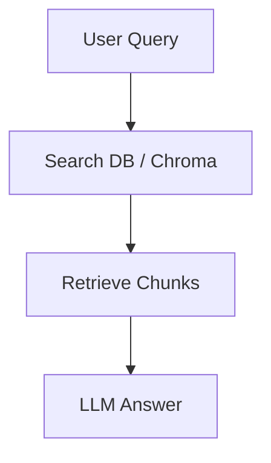

### Level 2: Breakdown, Expansion & Verification
A simple search isn't enough for broad questions. We introduce deterministic fan-out, subject extraction, compaction, and strict verification.
*Code Fact: The `SemanticSubQueryVerifierChain` aggressively rejects chunks if a query asks for differences but the chunk only provides similarities, or if new constraints are missing.*

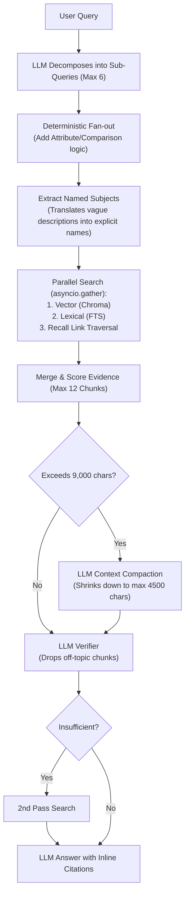

### Level 3: The Caching & SSE Trace Reality
Before executing *any* of the expensive graph above, the system checks Top-Level Caches. During execution, it intercepts LLM metrics to build the `retrieval_trace.ui` contract for the frontend.

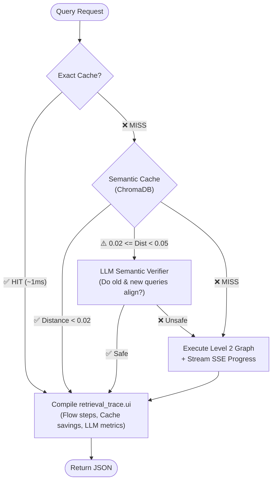

Here is the exact Python code from `server/src/services/rag/private/rag_service_impl.py` demonstrating the semantic caching threshold logic:

```python
    cached_match = await retrieval_cache.get_semantic_query_result(
        user_id,
        query,
        threshold=_QUERY_RESULT_SEMANTIC_THRESHOLD,  # 0.85 global cutoff
        emit_progress=False,
        filters_namespace=filters_sig,
    )
    if cached_match:
        cached_payload, cached_query, distance = cached_match
        
        # Skip the LLM verifier for near-exact matches.
        # Only run the verifier for genuinely similar-but-different queries.
        _EXACT_MATCH_EPSILON = 0.02
        if distance is not None and abs(distance) < _EXACT_MATCH_EPSILON:
            is_safe = True
        else:
            is_safe = await self.semantic_verifier.run(
                new_query=query,
                cached_query=cached_query,
                cached_answer=cached_payload.get("answer", ""),
                user_id=user_id,
                reporter=reporter
            )
```

### Level 4: The Full Integrated Picture
Now that the sub-components are clear, here is the exhaustive, end-to-end Query flow mapping exactly how a query travels from cache misses, to multi-strategy parallel searches, to LLM verification, to the final cited response.

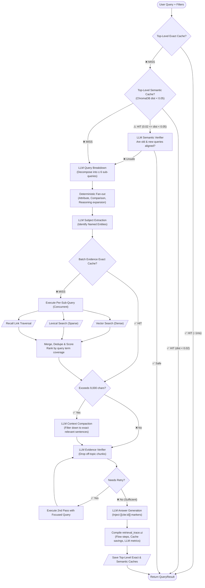

---

## Chapter 3: The Durability & Idempotency Layer

Running massive AI jobs in background workers requires network durability. If a server crashes mid-job, data cannot be lost.

### Level 1: The Transactional Outbox
We never save a note without guaranteeing it gets indexed.
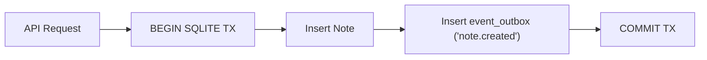

### Level 2: Redis Streams Dispatch
The outbox events are dispatched to a Redis Stream where worker processes consume them using a Consumer Group.
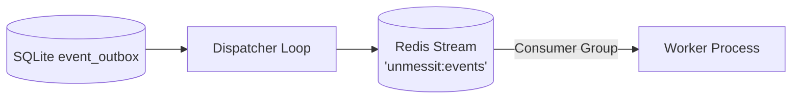

#### The Real Code Implementation
Here is the exact `XREADGROUP` consumer loop from `server/src/infra/events/redis_stream.py`:

```python
    async def _consume_messages(self, client) -> None:
        messages = await client.xreadgroup(
            GROUP,
            self._consumer,
            {STREAM: ">"},
            count=CONSUME_BATCH,
            block=BLOCK_MS,
        )
        for _, entries in messages or []:
            for redis_id, fields in entries:
                if await self._handle(fields):
                    # Only acknowledge if handler succeeded or safely skipped
                    await client.xack(STREAM, GROUP, redis_id)
```

### Level 3: Strict Handler Idempotency (The Full Picture)
Because Redis Streams guarantees *at-least-once* delivery, a worker might receive the same event twice. We block this at the database level so a Note isn't indexed twice.
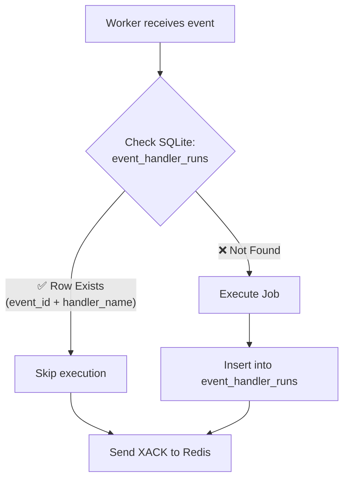

---

## Chapter 4: The SSE Infrastructure

While Redis Streams manages durable jobs, we need a volatile, high-speed way to push UI progress updates (e.g., "Indexing 50% complete", "Sub-query 1/3 searching...").

### Level 1: The Problem
WebSockets and SSE connections are held in the memory of the specific server process the user connected to.
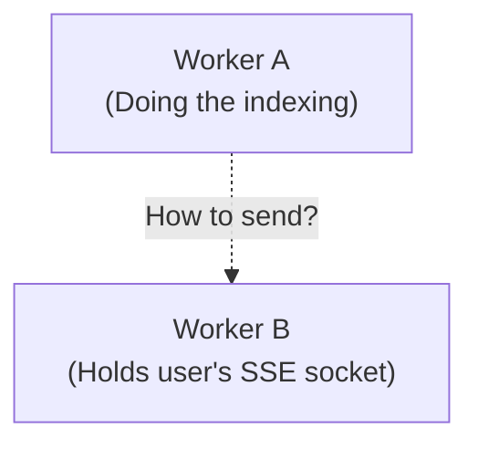

### Level 2: Redis Pub/Sub Fanout
We use Redis Pub/Sub to broadcast the update to all servers. The server that owns the socket forwards it to the user.
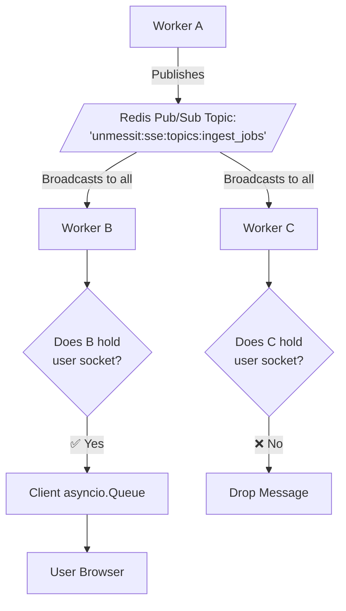

### Level 3: The Presence Heartbeat (The Full Picture)
To keep track of which instances hold which sockets, `RedisSseService` uses a TTL (Time-To-Live) heartbeat. It constantly writes to Redis to say "I am still alive and holding this socket." 

Here is the exact implementation from `server/src/infra/sse/redis_sse.py`:

```python
    async def _refresh_presence(self, connection_id: str, topic: str) -> None:
        while True:
            now = datetime.now(timezone.utc).isoformat()
            await set_json(
                _presence_key(connection_id),
                {
                    "instance_id": self._instance_id, 
                    "connection_id": connection_id, 
                    "topic": topic, 
                    "last_seen_at": now
                },
                PRESENCE_TTL_SECONDS, # 30 seconds
            )
            # Sleep for 1/3 of the TTL to guarantee it never expires while active
            await asyncio.sleep(PRESENCE_TTL_SECONDS / 3)
```

If a server process crashes, the TTL expires in 30 seconds, and the connection is naturally garbage-collected from the Redis presence registry. 

---
*(End of Architecture Novel)*
