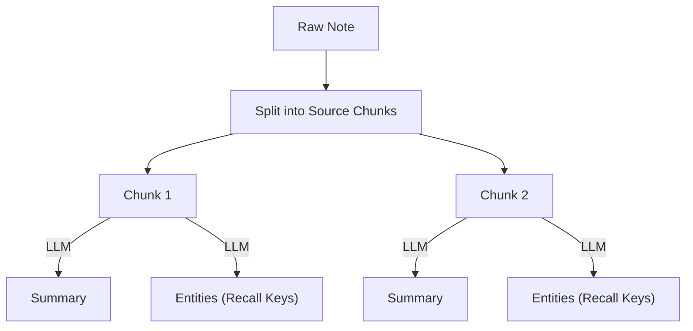
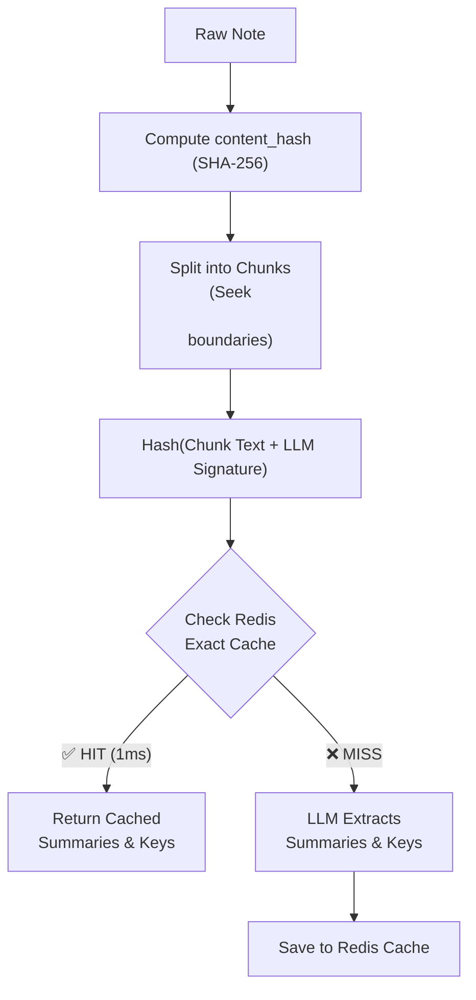
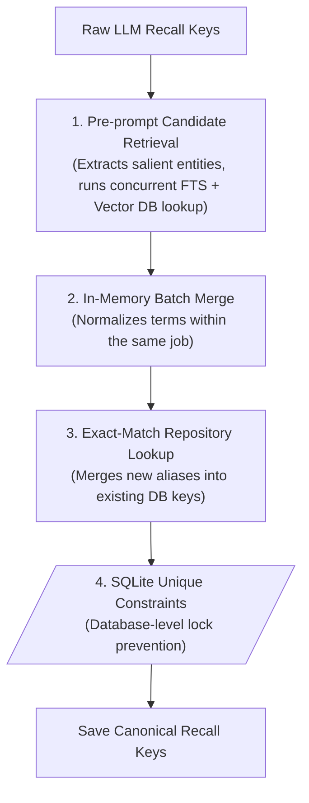
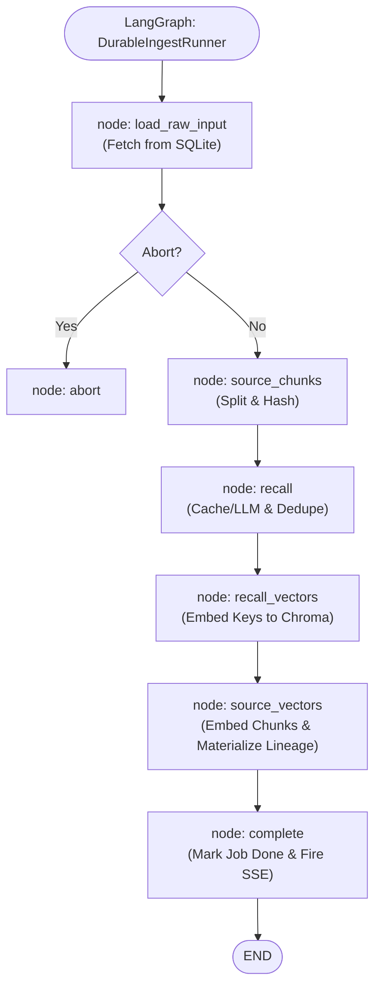

# The Indexing Engine

The indexing engine translates raw human notes into structured, retrievable vectors and entities. 

## Level 1: The Core Concept
At its most basic level, indexing is about chopping up a document and asking an LLM to explain what each piece means.



## Level 2: Idempotency, Splitting & Caching
If a user fixes a single typo in a 10,000-word document, we cannot afford to pay OpenAI to re-summarize the 9,999 words that didn't change. 
First, we split text cleanly. By default, `SourceWindowChain` splits at `2600` characters, but it intelligently seeks out double newlines (`\n\n`) to ensure paragraphs (and therefore complete ideas) are not severed in half.
We then introduce strict hashing and Exact Caching for every chunk.



## Level 3: The 4-Layer Deduplication Guard
When the LLM hallucinates slightly different entities (e.g., "Python 3" and "Python"), we must prevent graph sprawl. The `RecallNormalizerChain` handles this strict deduplication:


*(Code fact: The Normalizer caps aliases at 10 items, strictly enforces string length limits, and if an exact match is ambiguous, it falls back to the normalized name match to ensure safe merging).*

## Level 4: The Code Reality (Durable LangGraph)
Because indexing takes time and APIs fail, the entire sequence is wrapped in a durable LangGraph state machine. Each step acts as a deterministic checkpoint.



Here is the exact Python implementation from `server/src/services/rag/private/durability/runner.py` showing how this graph is constructed in memory:

```python
    def _build_graph(self):
        """Build the fixed durable ingest workflow once per runner."""
        graph = StateGraph(IngestGraphState)
        graph.add_node("load_raw_input", self._load_raw_input)
        graph.add_node("source_chunks", self._source_chunk_node)
        graph.add_node("recall", self._recall_node)
        graph.add_node("recall_vectors", self._recall_vector_node)
        graph.add_node("source_vectors", self._source_vector_node)
        graph.add_node("complete", self._complete_node)
        graph.add_node("abort", self._abort_node)
        
        graph.add_edge(START, "load_raw_input")
        graph.add_conditional_edges("load_raw_input", self._after_load_raw_input, {"abort": "abort", "continue": "source_chunks"})
        graph.add_edge("source_chunks", "recall")
        graph.add_edge("recall", "recall_vectors")
        graph.add_edge("recall_vectors", "source_vectors")
        graph.add_edge("source_vectors", "complete")
        
        graph.add_edge("complete", END)
        graph.add_edge("abort", END)
        return graph.compile()
```

## Level 5: The Full Integrated Picture
Now that we have explained every component piece-by-piece, here is the brutal reality of the absolute, end-to-end Indexing flow integrating the DB, the LangGraph, the Checkpoints, the Embedding, the Cache, and the SSE fanout.

```mermaid
flowchart TD
    START([fa:fa-play POST /notes/]) --> SAVENOTE
    SAVENOTE["Save note to SQLite\nWrite event_outbox ('note.created')"] --> SUBMIT
    SUBMIT["RAG Listener consumes event via Redis Streams\nsubmit_ingest_job(job_id=note_id)"] --> APIRET

    APIRET([Return 200 OK to User])

    SUBMIT -.-> BGWORK
    BGWORK(["Background Ingest Job Starts (LangGraph workflow)"]) --> RAWINPUT

    RAWINPUT["Hash text → content_hash\nSave/reuse raw_input row"] --> CHK_RAW
    CHK_RAW[/"Checkpoint: raw_input"/] --> SPLIT

    SPLIT["Split raw_input into source windows\nSave as source_chunks\nCompute deterministic piece hash"] --> CHK_PIECE
    CHK_PIECE[/"Checkpoint: source_piece"/] --> CHUNK_LOOP

    CHUNK_LOOP([▼ Loop over each source_chunk]) --> CACHE_SUMM

    CACHE_SUMM[/"Exact Cache: SourceChunkDraftChain\nKey: SHA256(text) + llm_sig"/] --> SUMM_Q

    SUMM_Q{"Summary\nCached?"} -->|"✅ HIT"| CACHE_REC
    SUMM_Q -->|"❌ MISS"| LLM_SUMM

    LLM_SUMM["LLM: Generate neutral summary\nSave to Exact Cache"] --> CACHE_REC

    CACHE_REC[/"Exact Cache: RecallDraftChain\nKey: SHA256(text) + llm_sig"/] --> REC_Q

    REC_Q{"Entities\nCached?"} -->|"✅ HIT"| DEDUPE
    REC_Q -->|"❌ MISS"| LLM_REC

    LLM_REC["LLM: Extract Recall Keys\nSave to Exact Cache"] --> DEDUPE

    DEDUPE["Deduplicate (4 layers)\nSave/update recall_keys\nAppend recall_links"] --> CHK_REC
    CHK_REC[/"Checkpoint: recall_chunk"/] --> NEXT_CHUNK

    NEXT_CHUNK([Proceed to Vectors]) --> EMBED
    EMBED["Embed source_chunks & recall_keys\nvia configured embedding model"] --> CHROMA
    CHROMA[/"Upsert to ChromaDB collections:\n- source_chunks\n- recall_keys"/] --> CHK_VEC

    CHK_VEC[/"Checkpoint:\n- source_vector\n- recall_key_vector"/] --> LINEAGE

    LINEAGE["Lineage Materialization\nParse note directory path (/A/B/C/)\nInject 'dir_A: True', 'dir_B: True'\ninto ChromaDB metadata"] --> SSE_PUB

    SSE_PUB["Publish ingest_job.changed to SSE"] --> FINISH

    FINISH["Mark Job Complete"] --> DONE
    DONE([Ingest Finished])
```


