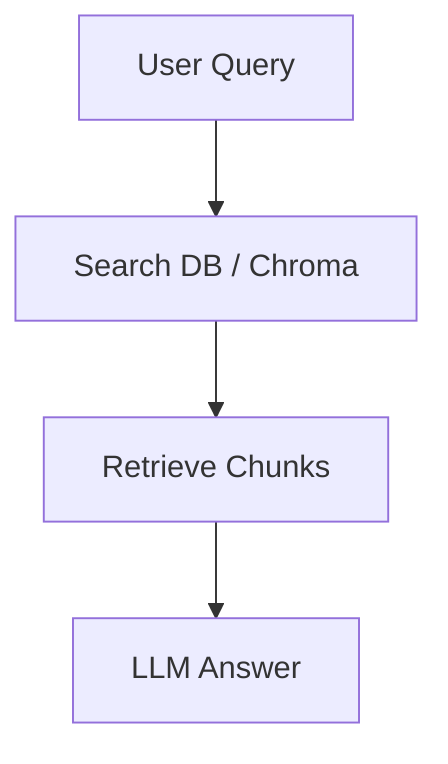
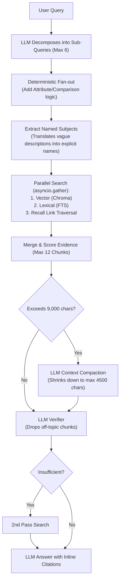
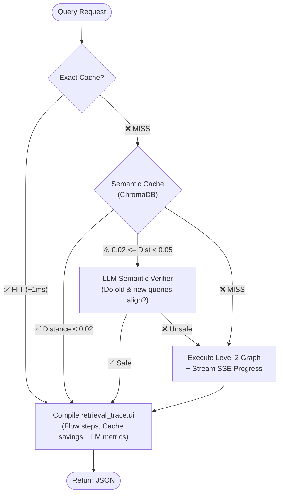
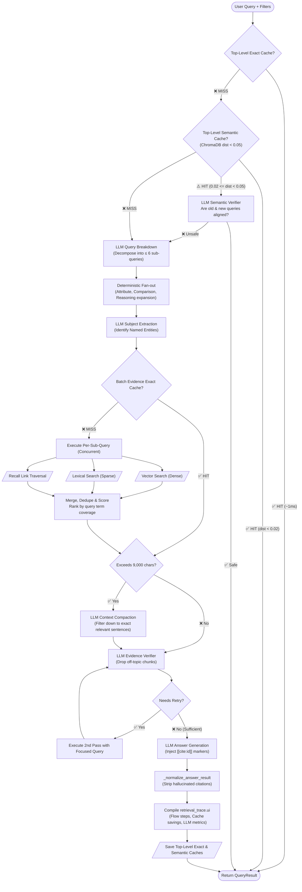

# The Query Engine

Retrieval must be highly accurate, fast, and prevent hallucinations. It does this by building up defensive layers.

## Level 1: Basic Retrieval

A basic vector search isn't enough for broad questions. We introduce deterministic fan-out, subject extraction, compaction, and strict verification.

## Level 2: Breakdown, Expansion & Verification

*Code Fact: The `SemanticSubQueryVerifierChain` aggressively rejects chunks if a query asks for differences but the chunk only provides similarities, or if new constraints are missing.*

## Level 3: The Caching & SSE Trace Reality
Before executing *any* of the expensive graph above, the system checks Top-Level Caches. During execution, it intercepts LLM metrics to build the `retrieval_trace.ui` contract for the frontend.



Here is the exact Python code from `server/src/services/rag/private/rag_service_impl.py` demonstrating the semantic caching threshold logic:

```python
    cached_match = await retrieval_cache.get_semantic_query_result(
        user_id,
        query,
        threshold=_QUERY_RESULT_SEMANTIC_THRESHOLD,  # 0.85 global cutoff
        emit_progress=False,
        filters_namespace=filters_sig,
    )
    if cached_match:
        cached_payload, cached_query, distance = cached_match
        
        # Skip the LLM verifier for near-exact matches.
        # Only run the verifier for genuinely similar-but-different queries.
        _EXACT_MATCH_EPSILON = 0.02
        if distance is not None and abs(distance) < _EXACT_MATCH_EPSILON:
            is_safe = True
        else:
            is_safe = await self.semantic_verifier.run(
                new_query=query,
                cached_query=cached_query,
                cached_answer=cached_payload.get("answer", ""),
                user_id=user_id,
                reporter=reporter
            )
```

## Level 4: Answer Generation & Citation Normalization
The finalized, compacted context is injected into the Answer Generation prompt. Rather than just asking the LLM to summarize, the `_answer_system_prompt` enforces strict synthesis rules (e.g., "Preserve exact actor/patient relationships", "Answer the supported part first and briefly name what is missing").

The LLM is instructed to embed `[cite](source_chunk_id)` markers inline with the text. The `_normalize_answer_result` function then aggressively parses this output.

Here is the exact code from `server/src/services/rag/private/chains/query/__init__.py`:

```python
def _normalize_answer_result(data, chunks):
    answer = str(data.get("answer")).strip()
    valid_ids = {chunk["id"] for chunk in chunks}
    
    # Extract modern [cite](id) markdown markers
    marker_ids = []
    for match in re.finditer(r'\[([^\]]+)\]\(([^)\s]+)\)', answer):
        if "cite" in match.group(1).lower() or match.group(2) in valid_ids:
            marker_ids.append(match.group(2))
            
    # Strip hallucinated citations not found in context
    marker_ids = [m for m in marker_ids if m in valid_ids]
    
    # Cap max citations and sanitize the final markdown
    data_ids = [str(i) for i in data.get("citation_ids", []) if str(i) in valid_ids]
    citation_ids = list(dict.fromkeys([*data_ids, *marker_ids]))[:6]
    
    answer = _sanitize_answer_citations(answer, set(citation_ids))
    
    return {"answer": answer, "citation_ids": citation_ids}
```

The returned payload is saved in the Top-Level exact cache so identical queries return instantly without any processing.

## Level 5: The Full Integrated Picture
Now that the sub-components are clear, here is the exhaustive, end-to-end Query flow mapping exactly how a query travels from cache misses, to multi-strategy parallel searches, to LLM verification, to the final cited response.


