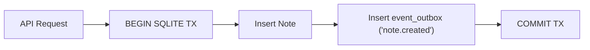
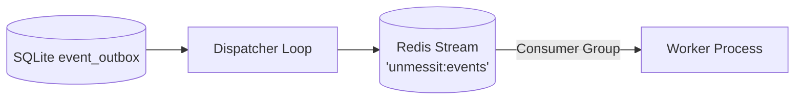
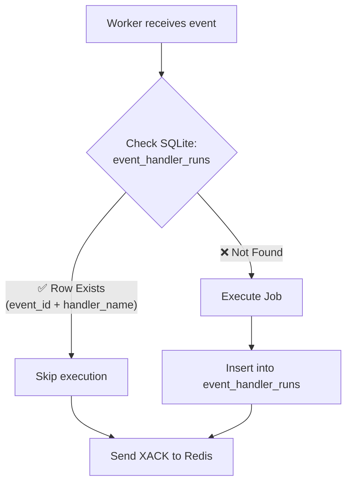
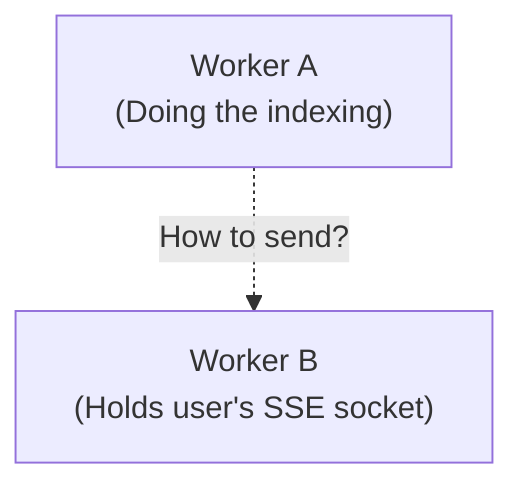
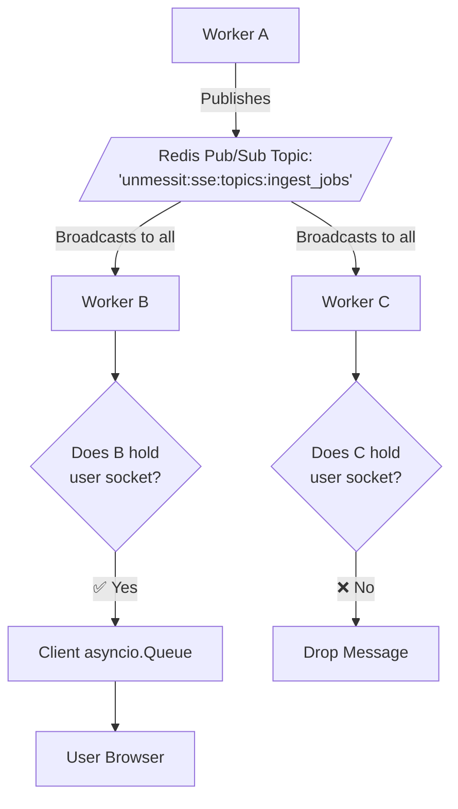

# Supporting Systems

Running massive AI jobs in background workers requires network durability. If a server crashes mid-job, data cannot be lost.

## 1. The Transactional Outbox
We never save a note without guaranteeing it gets indexed.


## 2. Redis Streams Dispatch
The outbox events are dispatched to a Redis Stream where worker processes consume them using a Consumer Group.


### The Real Code Implementation
Here is the exact `XREADGROUP` consumer loop from `server/src/infra/events/redis_stream.py`:

```python
    async def _consume_messages(self, client) -> None:
        messages = await client.xreadgroup(
            GROUP,
            self._consumer,
            {STREAM: ">"},
            count=CONSUME_BATCH,
            block=BLOCK_MS,
        )
        for _, entries in messages or []:
            for redis_id, fields in entries:
                if await self._handle(fields):
                    # Only acknowledge if handler succeeded or safely skipped
                    await client.xack(STREAM, GROUP, redis_id)
```

## 3. Strict Handler Idempotency
Because Redis Streams guarantees *at-least-once* delivery, a worker might receive the same event twice. We block this at the database level so a Note isn't indexed twice.


## 4. The SSE Infrastructure

While Redis Streams manages durable jobs, we need a volatile, high-speed way to push UI progress updates (e.g., "Indexing 50% complete", "Sub-query 1/3 searching...").

### The Problem
WebSockets and SSE connections are held in the memory of the specific server process the user connected to.


### Redis Pub/Sub Fanout
We use Redis Pub/Sub to broadcast the update to all servers. The server that owns the socket forwards it to the user.

